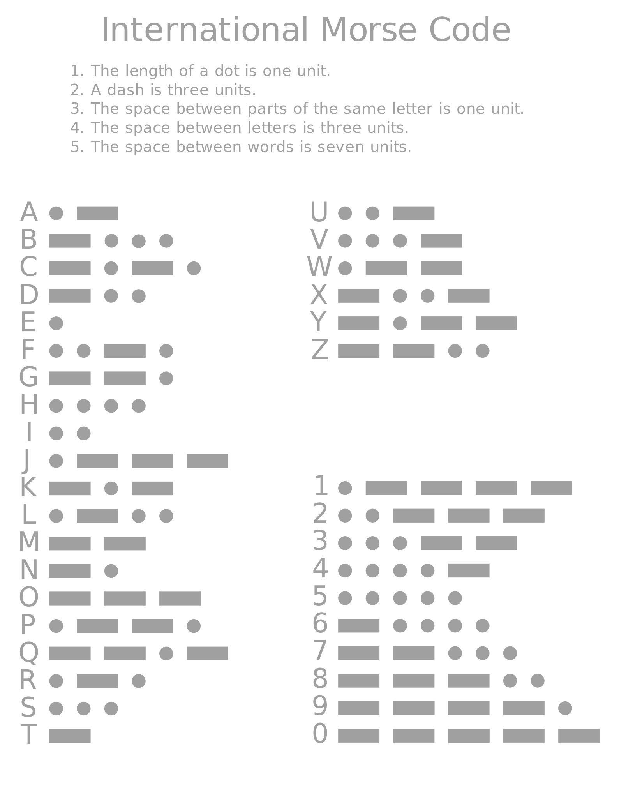

# twitter_morse
__Arduino UNO__ project using Processing which communicates with Twitter. Insert you Acces Tokens in the .pde file which you can open with Processing. To acquire the tokens create a twitter developer account with elevated access [here](https://developer.twitter.com/en).

The arduino connects a buzzer on pin 9 and ground. Note that a 100 ohm resistor is used for the buzzer.
 
 

